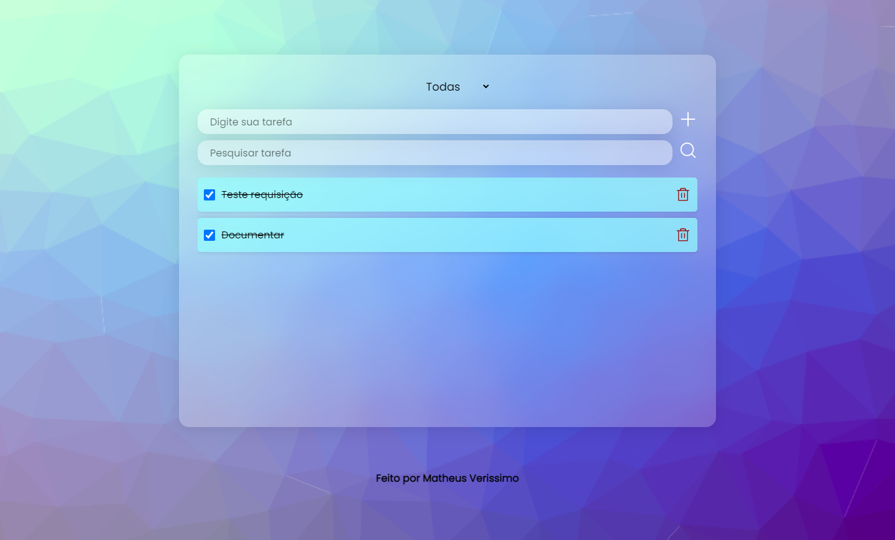
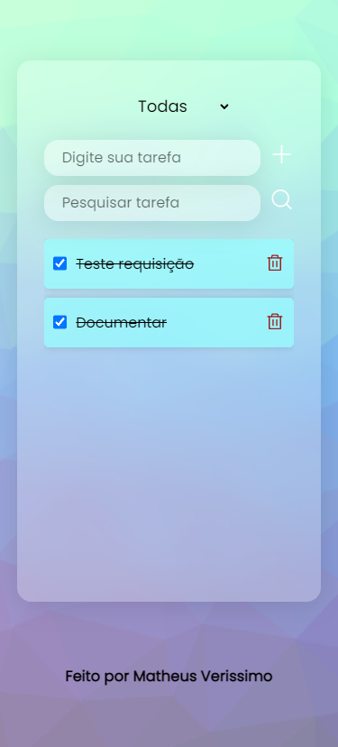

# Todo App

Um CRUD de lista de tarefas.

## Screenshots


<p align="center">

</p>

## Link

Link: https://ignite-lab-react-three.vercel.app/

## Construído com

-   React
-   Typescript 
-   Styled Components
-   Axios
-   Phosphor-react

## Executando o projeto

Pelo seu terminal navegue até a pasta do projeto e execute:

```cl
  npm install
  npm run dev
```

## Autores

-   [@Mveryy](https://github.com/Mveryy)